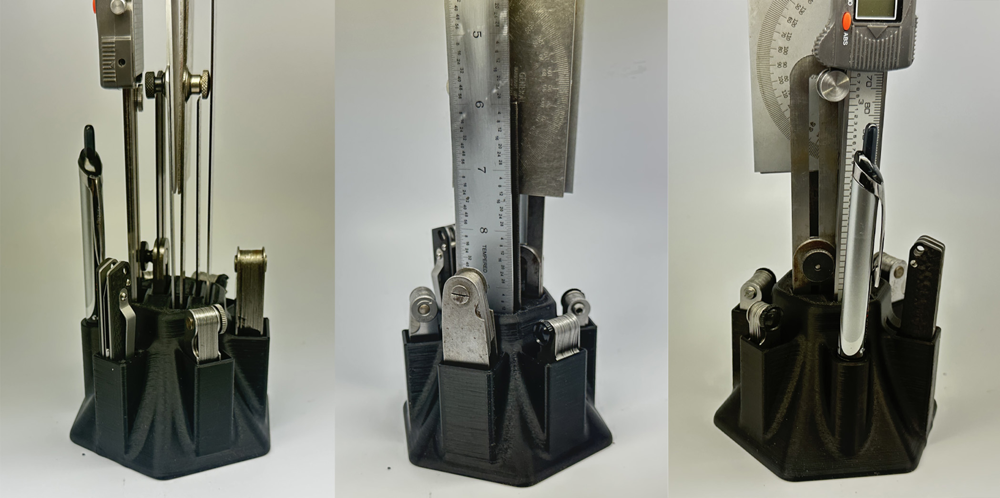

# The Measuring Tool Stand

I got tired of all my measuring tools laying in a heap on my desk so I drew up this stand to keep them all organized and in a smaller footprint.

Designed specifically for FDM, all the parts print without support and should fit on most printer beds.

Made to specifically fit the products shown (linked below).

1. [SPI 15-719-8 Digital Caliper](https://www.mscdirect.com/product/details/44706968?mscNew=true&rItem=44706968)
2. [Starrett No. 47 SLiding Bevel](https://www.mscdirect.com/product/details/86402922)
3. [2x Starrett No. C183 Protractors](https://www.mscdirect.com/product/details/86402922)
4. [Lufkin No. 2204R 6in Tempered Steel Rule](https://www.ebay.com/itm/185663744049?chn=ps&_trkparms=ispr%3D1&amdata=enc%3A1GuWzVBchTw6J07w_DDuLkQ41&norover=1&mkevt=1&mkrid=711-213727-13078-0&mkcid=2&itemid=185663744049&targetid=4580702891777578&device=c&mktype=&googleloc=&poi=&campaignid=418640321&mkgroupid=1233652283797640&rlsatarget=pla-4580702891777578&abcId=9300602&merchantid=51291)
5. [12in/300mm Steel Rule](https://www.mscdirect.com/product/details/78988201)
6. [Folding Scalpel Knife, No. 60 blade](https://www.aliexpress.com/item/3256803160021123.html?spm=a2g0o.order_list.order_list_main.15.793018023OPF7f) 
7. [Mitutoyo No. 186-101 Radius Gage Set](https://www.mscdirect.com/product/details/06242531)
8. [Starrett No. 178-B Radius Gage Set (specifically this version since the new design is untested)](https://www.ebay.com/itm/225215987076?mkcid=16&mkevt=1&mkrid=711-127632-2357-0&ssspo=6aQ4T9HYQoe&sssrc=2047675&ssuid=&widget_ver=artemis&media=COPY)
9. [SPI 14-034-3 Imperial Thread Pitch Gage (unsure of fit since it appears they've changed the design slightly as mine has plastic tension nuts)](https://www.mscdirect.com/product/details/01221027?orderedAs=14-034-3&pxno=68885099)
10. [SPI 14-030-1 Metric Thread Pitch Gage (unsure of fit since it appears they've changed the design slightly as mine has plastic tension nuts)](https://www.mscdirect.com/product/details/01221019)
11. [Pilot Precise V5 RT (or any pen with a body design less than 11mm in outside diameter)](https://www.amazon.com/Pilot-Precise-Retractable-Rolling-26050/dp/B001BQADT0/ref=sr_1_10?crid=UBINPKZ0BS68&keywords=pilot%2Bprecise%2Bv5%2Brt&qid=1677088021&sprefix=pilot%2Bpre%2Caps%2C93&sr=8-10&th=1)

# License

 This work is licensed under a <a rel="license" href="http://creativecommons.org/licenses/by/4.0/">Creative Commons Attribution 4.0 International License</a>.
